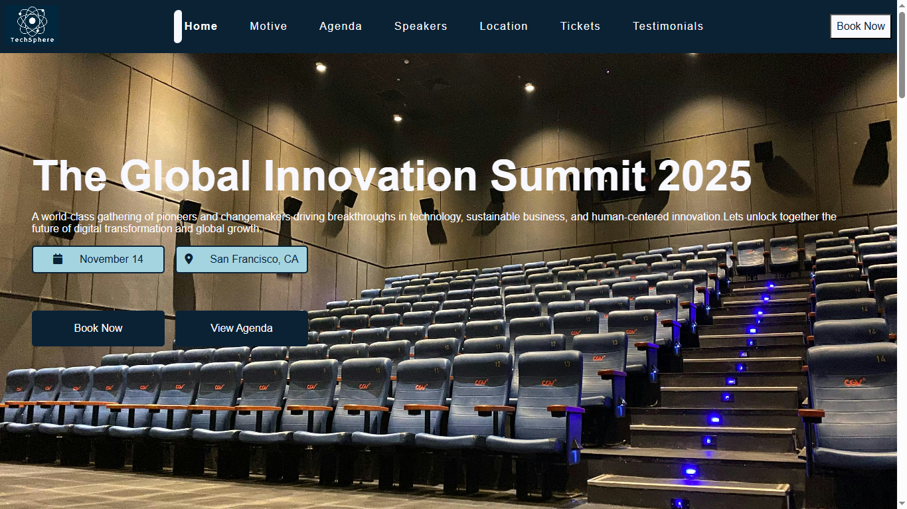
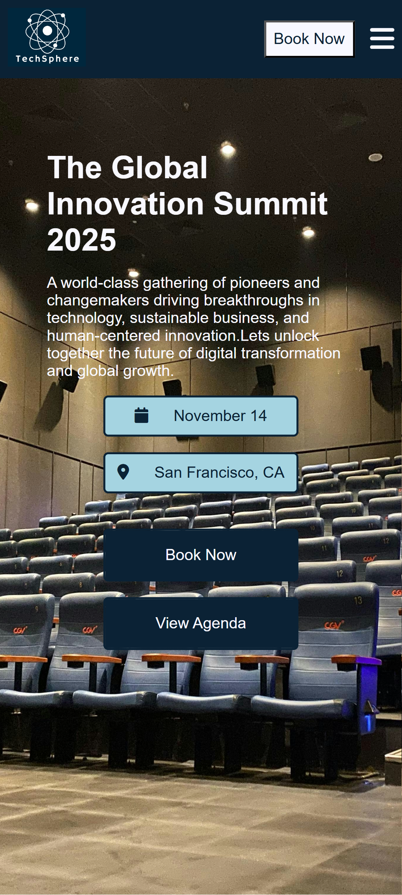

 # 🎨 TechSphere- Sass(SCSS) Based Conference Event Landing Page 
 


This is a fully self-designed frontend project showcasing **SCSS/Sass **skills, including modular structure, reusable components, and responsive design techniques. Built without referencing any Figma or UI template.

## Purpose
This project was created to:

- Practice and showcase advanced SCSS/Sass techniques
- Enhanced HTML templates with SCSS for a scalable and clean stylesheet architecture
- Designed a responsive system with reusable SCSS components.

## Tech Stack  

- HTML5
- Sass (SCSS) 

## Features

- Built entirely with **SCSS (Sass)**
- Follows best practices:
  - Nesting for scoped styles
  - Partials system for scalability and reusability.
  - Mixins for reusable patterns
  - Namespaces for avoiding conflicts
  - Variables for colors, fonts, and spacing to ensure a consistent look and feel.
- Includes custom-built sections like hero, agenda,speakers, call-to-action, footer etc.
- Utilizes flexbox, grid, and transitions for smooth layout and interaction.


## Screenshots 

<p align="center">
  
  
  
</p>


## Live Demo 

🔗 [View Live Site](https://tech-sphere1.netlify.app/)


## Project Structure

``` 
/ 
├── assets/ 
│   └── desktop.png 
│   └── mobile.png 
│   └── tablet.png 
├── css/ 
│   └── style.css 
├── images/ 
│   ├── speakers/
│   |    └── speakers1.jpg
│   |    └── speakers2.jpg
│   |    └── speakers3.jpg
│   ├── testiminials/
│   |    └── profile1.jpg
│   |    └── profile2.jpg
|   ├── conference.jpg
|   ├── loc2.jpg
|   ├── logo-inverted.jpg
|   └── logo.jpg
├── src/
│   └── scss/
│       ├── scss/
│       |    ├── abstract/
│       |    |   └── _breakponits.scss
│       |    |   └── _components.scss
│       |    |   └── _helper.scss
│       |    |   └── _mixins.scss
│       |    |   └── _variables.scss
│       |    └── base/
│       |        └── basic.scss
│       ├── index.html 
│       ├── main.js 
│       └── style.scss
├── package-lock.json 
├── package.json 
└── README.md 
``` 

## 📦 Usage

1. Clone the repository

```bash
git clone https://github.com/sam8284/sass-conference-landing.git
```

2. Navigate to the project directory

```bash
cd sass-conference-landing
```

3. Run the App:
- Open the index.html file in your browser or use a live server (like VS Code Live Server extension) for better development experience.

```bash
open index.html
```

### Note:
If you want to make changes to the Sass files, follow these steps:

- Installs Sass globally on your system, so you can use the sass command anywhere.

```bash
npm install -g sass
```

- Compiles your Sass file (style.scss) into CSS (style.css).
```bash
sass src/scss/style.scss css/style.css
```

- Use watch mode during development for auto-compilation or use a live sass compiler (like VS Code Live Sass Compiler extension) for efficiency.

```bash
sass --watch src/scss/style.css/style.css
```


## Contact

[](mailto:saima.ansari8811@gmail.com?subject=Hello&body=I%20found%20your%20project%20interesting!)


[](https://www.linkedin.com/in/saima-ansari-dev/)


## License

This project is licensed under the MIT License. See the [MIT LICENSE](./LICENSE) file for more information.


## Acknowledgement
- [Sass Guidelines](https://sass-guidelin.es/) for SCSS best practices
- [Font Awesome](https://fontawesome.com/icons) for icons
- [Unsplash](https://unsplash.com/) for demo images

